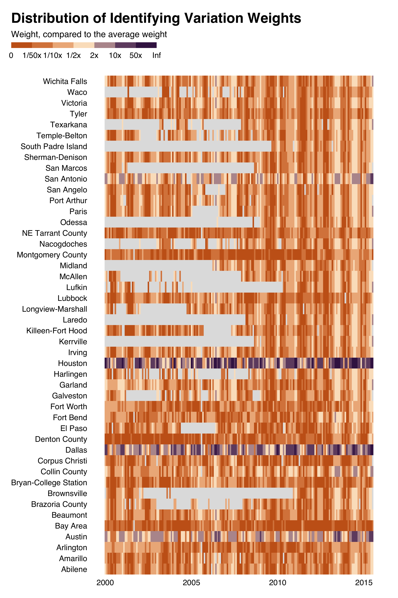
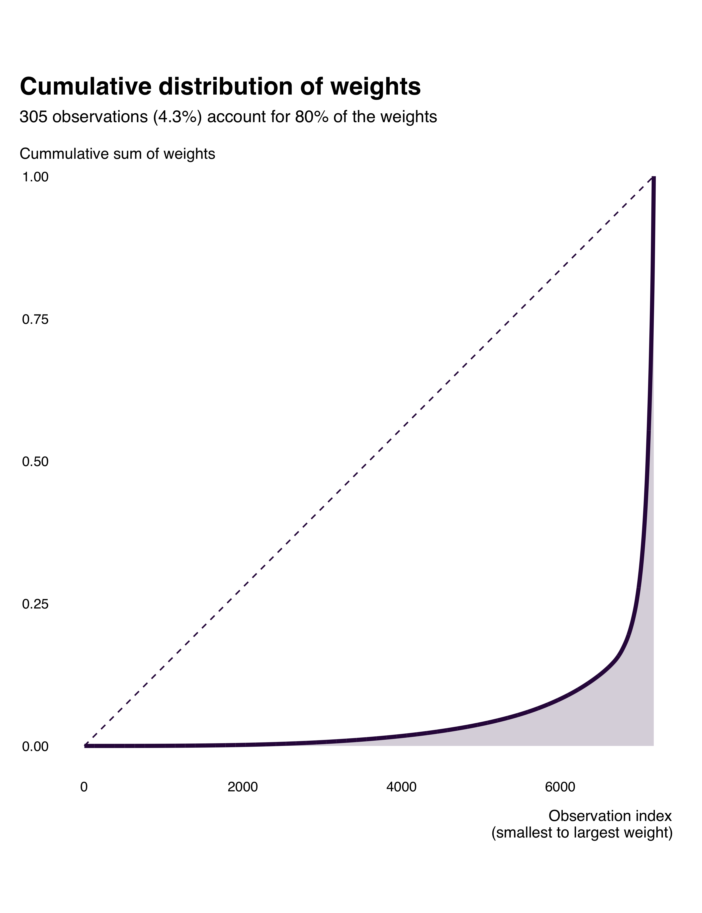
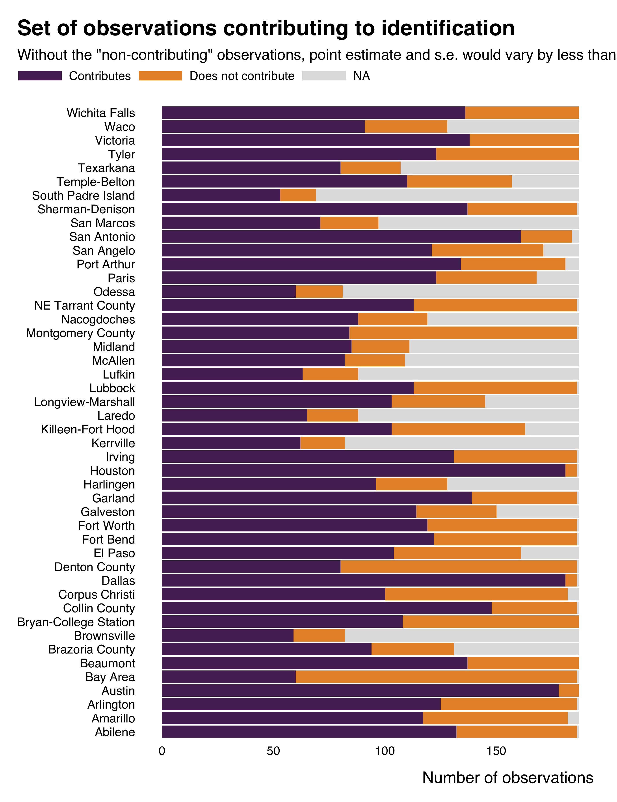

<!-- README.md is generated from README.Rmd. Please edit that file -->

# ididvar

<!-- badges: start -->

<!-- badges: end -->

This package provide tools to **identify the identifying variation in a
regression**. It is specifically built for analysis in **economics**.

This package is built as part of a [research
project](https://vincentbagilet.github.io/causal_exaggeration/). As
such, the [associated
paper](https://vincentbagilet.github.io/causal_exaggeration/causal_exaggeration_paper.pdf)
provides a detailed scientific description of its content and of its
underpinnings. Online appendices of the paper also provide a thorough
example of a practical implementation of an analysis using the `ididvar`
package.

## Installation

You can install the development version of `ididvar` from
[GitHub](https://github.com/vincentbagilet/ididvar) with:

``` r
# install.packages("devtools")
devtools::install_github("vincentbagilet/ididvar")
```

## Usage

This package allows easily compute identifying variation weights and
works with a breadth of estimation packages (`lm`, `plm`, `fixest` for
instance).

``` r
library(ididvar)

reg_ex_fixest <- ggplot2::txhousing  |>
  fixest::feols(fml = volume ~ sales + listings |  as.factor(date) + city)

idid_weights(reg_ex_fixest, "sales") |>
  head()
#> [1] 9.955586e-05 3.237369e-05 3.690329e-06 6.079059e-06 2.013290e-10
#> [6] 4.469283e-07
```

It then allows to explore them through visualizations.

``` r
library(ggplot2)

idid_viz_weights(reg_ex_fixest, "sales", date, city) +
  ggplot2::labs(x = NULL, y = NULL)
```



``` r
idid_weights(reg_ex_fixest, "sales") |>
  idid_viz_cumul()
```



It also allows to easily find observation that actually contribute to
identification (in the sense that we can drom observations that “do not
contribute” without the estimate changing more than a given proportion).

``` r
idid_viz_contrib(reg_ex_fixest, "sales", city) +
  ggplot2::labs(x = NULL) +
  ggplot2::coord_flip()
```


