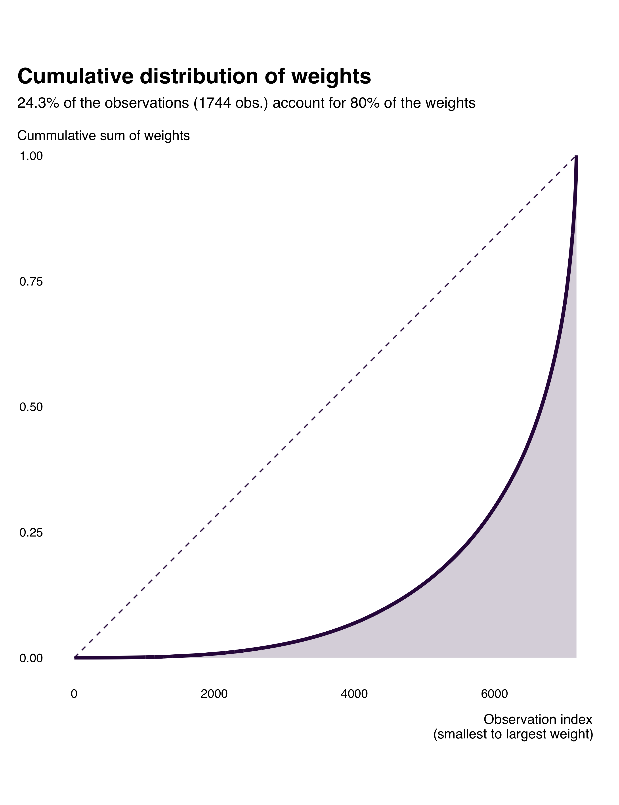
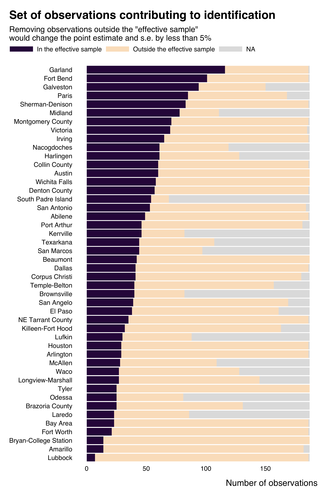

<!-- README.md is generated from README.Rmd. Please edit that file -->

# ididvar

<!-- badges: start -->

<!-- badges: end -->

This package provides tools to easily **identify the identifying
variation in a regression**, specifically in **applied economics**
analyses.

This package is built as part of a [research
project](https://vincentbagilet.github.io/causal_exaggeration/). As
such, the [associated
paper](https://vincentbagilet.github.io/causal_exaggeration/causal_exaggeration_paper.pdf)
provides a detailed scientific description of its content and of its
underpinnings.

## Installation

You can install the development version of `ididvar` from
[GitHub](https://github.com/vincentbagilet/ididvar) with:

``` r
# install.packages("devtools")
devtools::install_github("vincentbagilet/ididvar")
```

## Usage

Most of the functions of the package take as input the output of a
regression and the name of the variable of interest. `ididvar` supports
a breadth of estimation packages (`lm`, `plm`, `fixest` for instance).

First, the package provides a straightforward function to compute
identifying variation weights.

``` r
library(ididvar)
library(ggplot2)

reg_ex_fixest <- ggplot2::txhousing |>
  fixest::feols(fml = volume ~ sales + listings |  as.factor(date) + city)

idid_weights(reg_ex_fixest, "sales") |>
  head()
#> [1] 9.955586e-05 3.237369e-05 3.690329e-06 6.079059e-06 2.013290e-10
#> [6] 4.469283e-07
```

The package also allows for an effortless exploration of these weights
through visualizations.

``` r
idid_viz_weights(reg_ex_fixest, "sales", date, city, order = "y") +
  ggplot2::labs(x = NULL, y = NULL) 
```


In this particular (somehow silly) regression, most of the identifying
variation comes from a few cities: Houston, Dallas, Austin and San
Antonio.

``` r
idid_viz_cumul(reg_ex_fixest, "sales")
```



It also provide functions to identify observations that actually
contribute to identification (in the sense that dropping the other
observations does not significantly affect the estimate obtained).

``` r
idid_viz_contrib(reg_ex_fixest, "sales", var_y = city, order = "y") +
  ggplot2::labs(y = NULL)
```



The package provides a larger [set of
functions](docs/reference/index.html). The [Get started
vignette](articles/ididvar.html) introduces them in a concise manner,
while also describing a typical workflow for analysis.

[Online
appendices](https://vincentbagilet.github.io/causal_exaggeration/) of
the [associated
paper](https://vincentbagilet.github.io/causal_exaggeration/causal_exaggeration_paper.pdf)
complements this vignette by providing a thorough example of a practical
implementation of an analysis using the `ididvar` package.
