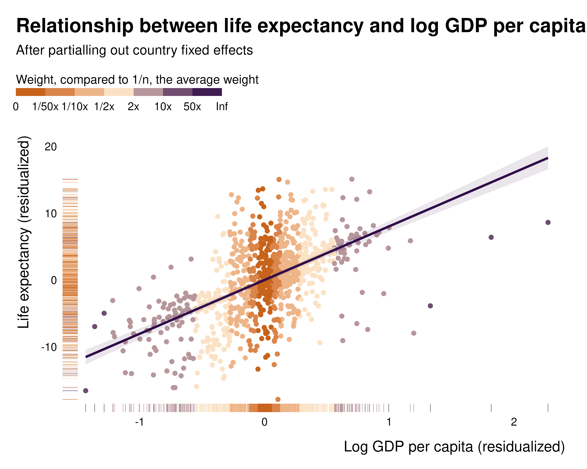
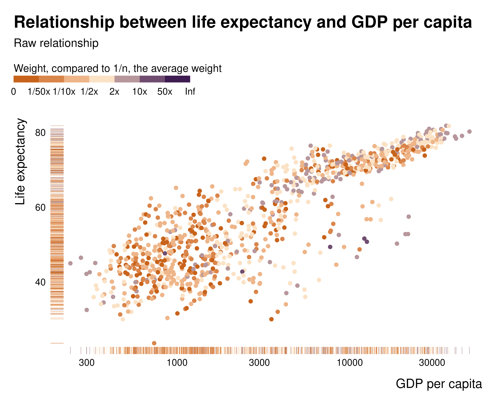

# Background on the weights

This document very quickly introduces the maths and theory behind the
weights. More detail is available in the [associated research
paper](https://vincentbagilet.github.io/causal_exaggeration/causal_exaggeration_paper.pdf).

## Intuition

These weights **represent how much each observation contributes to the
identification**. They correspond to the leverage of each observation in
the bivariate regression of the independent variable on the treatment or
main variable of interest, after partialling out the controls.They are
equivalent–up to a normalization to one–to the multiple regression
weights defined by [Aronow and Samii
(2016)](https://onlinelibrary.wiley.com/doi/abs/10.1111/ajps.12185) and
previously discussed in [Angrist and Pischke
(2009)](https://www.jstor.org/stable/j.ctvcm4j72). Observations for
which the main variable of interest is well explained by controls only
contribute little to identification; the controls or fixed effects
absorb most of the variation.

A range of existing tools from the statistics literature, such as
leverage and Cook’s distance, already measure the influence of
individual observations on regression parameters. These measures,
however, assess influence on the parameter vector and are not directly
suited for applied economics where interest is typically confined to a
single parameter: the coefficient of the treatment variable. To get to a
more suited measure, the present procedure consists in first applying
the Frisch-Waugh-Lovell theorem and then computing leverage for the
regression of the residualized outcome on the residualized treatment.
The residuals are obtained from regressions on the full set of controls,
including fixed effects and other identification-related controls such
as control functions. This produces observation-specific weights
describing the extent to which each observation contributes to the
estimation of the treatment effect.

The weight of each observation $`i \in \{1, ..., N\}`$ is:

``` math
w_i = \dfrac{\left( x_i - \mathbb{E}[x_i | C_i] \right)^2 }{\sum_j w_j}
```
where $`x`$ is the variable of interest and $`C`$ the vector of controls
and fixed effects. These weights are therefore the normalized squared
residuals of the regression of $`x`$ on the full set of controls.

In the package, they are computed using the same estimation procedure as
the one used in the main regression, just replacing the outcome variable
with the dependent variable of interest. The following example
illustrates how the `idid_partial_out` function works on an example
model describing the relationship between median price and number of
housing sales in Texas:

``` r

library(ididvar)
library(ggplot2)
library(dplyr)
library(fixest)

reg_ex_fixest <- ggplot2::txhousing |>
  mutate(l_sales = log(sales)) |> 
  fixest::feols(fml = l_sales ~ median + listings | year + city, vcov = "twoway")

idid_partial_out(reg_ex_fixest, "median") |> 
  head()
#> [1]  4357.90243 -8317.76671 -8897.22065  1603.32003   308.18621   -99.38339

txhousing |> 
  feols(fml = median ~ listings | year + city, vcov = "twoway") |> 
  residuals() |> 
  head()
#> [1]  4357.90243 -8317.76671 -8897.22065  1603.32003   308.18621   -99.38339
```

## Group level weights

One can compute group level weights by summing the weights of
observations within that group. This allows for a quick computation and
interpretation of weights at higher aggregation levels. These
group-level weights correspond to the within-group variance of the
conditional treatment status.

In low weight groups, there is only a little amount of variation in the
dependent variable to estimate an effect. Considering an extreme case
gives a clear intuition: when using group level fixed effects, if there
is no variation in $`x`$ for that group, this group does not contribute
to the estimation of the parameter for $`x`$ at all. For instance, in
the previous example, if all prices are the same in a given city, it
will not be possible to estimate how variations in prices are related
with variation in sales in that city.

## What do they represent, really?

By definition, in the partialled out regression, these weights represent
the squared-distance to the center of the distribution of the variable
of interest, after partialling out the controls. The following example,
describing the relationship between x and y partialled out and the
weights illustrates this:



While this pattern clearly appears in the partialled out regression, it
is much less visible when plotting the raw relationship, hence the
importance of analysing those weights and plotting the partialled out
regression:



## What the weights are

`ididvar` computes, for each observation, its contribution to the
estimate of a treatment coefficient.

Standard influence measures are not suited to this. Leverage and Cook’s
distance describe the influence of an observation on the entire
parameter vector, mixing the treatment with the controls, whereas a
causal analysis targets one coefficient. An observation can have high
leverage and contribute almost nothing to the treatment effect, and the
reverse \[@aronow_samii2016, App. B\].

The metric implemented here is the leverage of the regression that
actually produces the treatment coefficient. By the Frisch-Waugh-Lovell
theorem, that coefficient is obtained by regressing the residualized
outcome on the residualized treatment, both partialled out on the full
control set. That regression has one regressor and no intercept, so the
leverage of observation $`i`$ is

``` math
h_i = \frac{\tilde T_i^2}{\sum_j \tilde T_j^2}, \qquad \tilde T_i = T_i - \hat{\mathbb{E}}[T_i \mid C_i]
```

and sums to one across observations. The numerator is the multiple
regression weight of @aronow_samii2016, so with a single parameter of
interest the two coincide up to that normalization. With several
parameters of interest the leverage generalizes to
$`\tilde{\mathbf{t}}_i'(\tilde{\mathbf{T}}'\tilde{\mathbf{T}})^{-1}\tilde{\mathbf{t}}_i`$
and the two objects separate.

The control set $`C`$ is where the package departs from existing
implementations. It includes the *causal* controls: the fixed effects,
control functions and first-stage residuals through which an
identification strategy operates. Reading causal strategies as forms of
controlling makes the same weight computable across designs, so that
weights from a fixed effects specification, an IV and an OLS with
covariates are all on the same footing and can be compared.

## Why they matter, in the simplest possible case

The weights are usually introduced as a concern about heterogeneity:
when treatment effects vary, the coefficient is a weighted average of
unit-level effects rather than the average treatment effect
\[@angrist1998; @angrist_krueger1999; @aronow_samii2016;
@sloczynski2022\]. That framing invites the reading that the problem
belongs to observational work, where selection into treatment is the
culprit.

It does not. Consider a randomized experiment with two strata of equal
size. Treatment is assigned at random within each stratum, so there is
no confounding conditional on the stratum, but at different rates: 50%
in stratum A and 10% in stratum B. The treatment effect is 1 in A and 4
in B. The stratum also shifts the baseline outcome, so the stratum must
be controlled for.

``` r

library(dplyr)
set.seed(1)

N <- 10000

data <- tibble(
  group    = rep(c("A", "B"), each = N/2),
  beta     = ifelse(group == "A", 1, 4),
  baseline = ifelse(group == "A", 0, 3),
  treated  = rbinom(N, 1, ifelse(group == "A", 0.5, 0.1)),
  y_obs    = baseline + beta * treated + rnorm(N)
)
```

The average treatment effect is the average of the unit-level effects:

``` r

mean(data$beta)
#> [1] 2.5
```

The regression returns something else:

``` r

coef(lm(y_obs ~ treated + group, data = data))[["treated"]]
#> [1] 1.792788
```

Nothing here can be attributed to identification. Assignment is random
within stratum, the stratum is controlled for, and the model matches the
data generating process exactly.

## Where the discrepancy comes from

With the stratum indicator as the only control, partialling out reduces
to demeaning within stratum. Summing the squared residuals by stratum
gives each stratum’s share of the identifying variation:

``` r

weights <- data |>
  group_by(group) |>
  summarise(
    beta          = first(beta),
    share_treated = mean(treated),
    weight        = sum((treated - mean(treated))^2)
  )

weights
#> # A tibble: 2 × 4
#>   group  beta share_treated weight
#>   <chr> <dbl>         <dbl>  <dbl>
#> 1 A         1         0.487  1249.
#> 2 B         4         0.102   456.
```

Stratum B holds half the sample and a quarter of the identifying
variation: its imbalance leaves little variation in treatment once the
stratum is partialled out. The coefficient is the average of the stratum
effects weighted by these quantities,

``` r

sum(weights$beta * weights$weight) / sum(weights$weight)
#> [1] 1.80276
```

which reproduces the regression coefficient up to sampling noise. The
stratum carrying the larger effect is the one the design mutes.
@aronow_samii2016 note this case for block-randomized designs \[fn. 15,
p. 256\], and @sloczynski2022 develops it into diagnostics based on the
treated share.

## Two remarks

The regression above is not confounded. Conditioning on the stratum
eliminates confounding exactly, as intended. What changes is the
estimand: the coefficient is a weighted average of stratum-specific
effects rather than their simple average, with weights set by the design
rather than chosen. Reporting it as an average treatment effect is what
fails, not the identification strategy.

Second, the concern above rests entirely on the effects differing across
strata. Setting them equal switches it off: the estimand returns to the
true effect whatever the weights. The weights themselves do not become
equal, and the total identifying variation they represent is unchanged
by the assumption. That total governs the precision of the estimator
rather than its estimand, which is the reason `ididvar` reports the
effective sample alongside the weights: normalizing to one preserves the
composition of the identifying variation and discards its amount.
