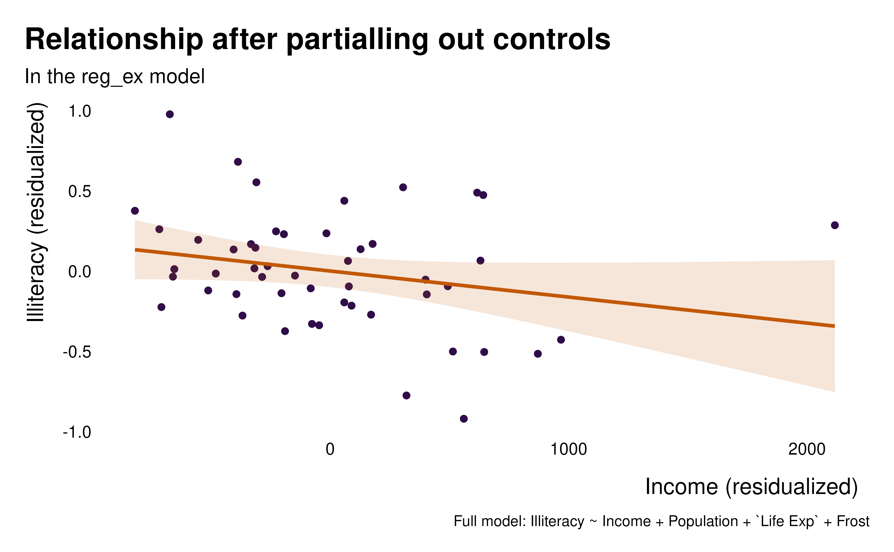
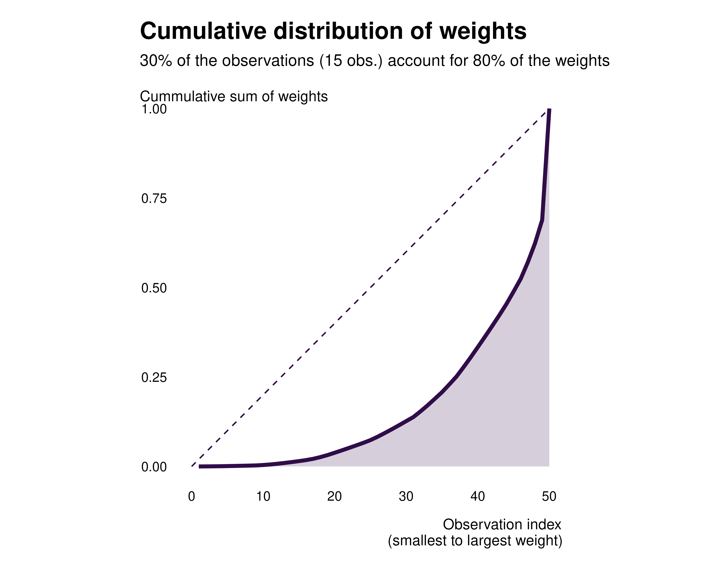
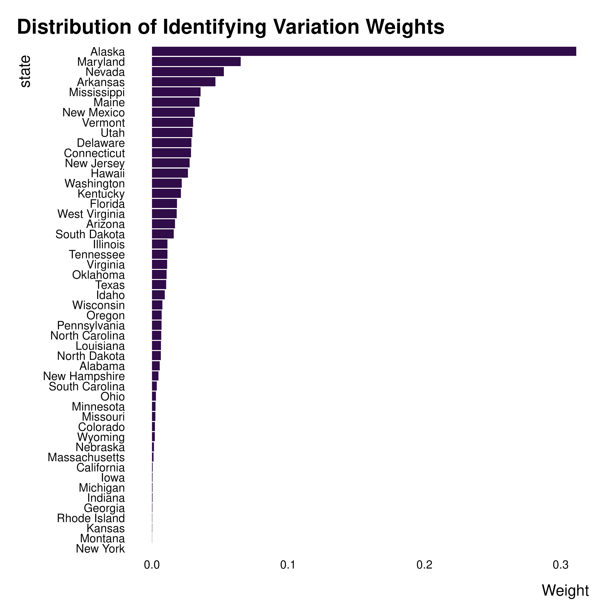
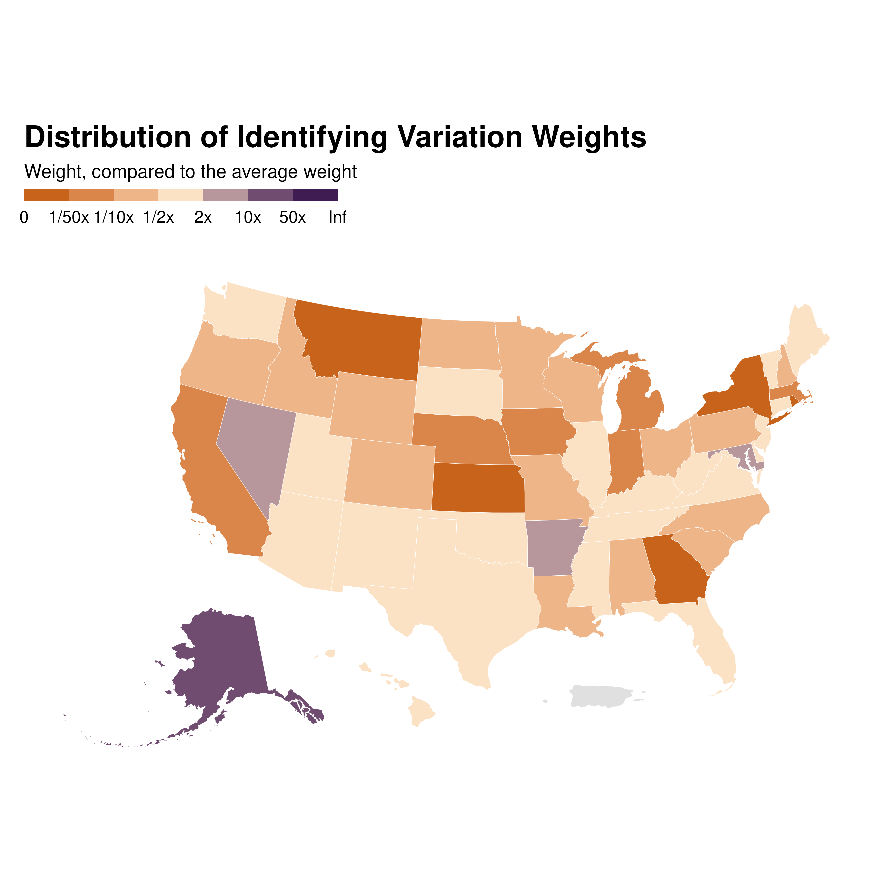
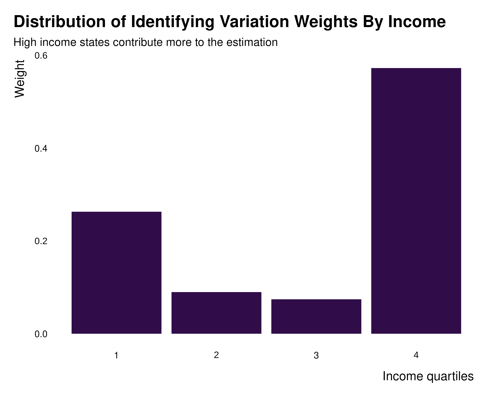
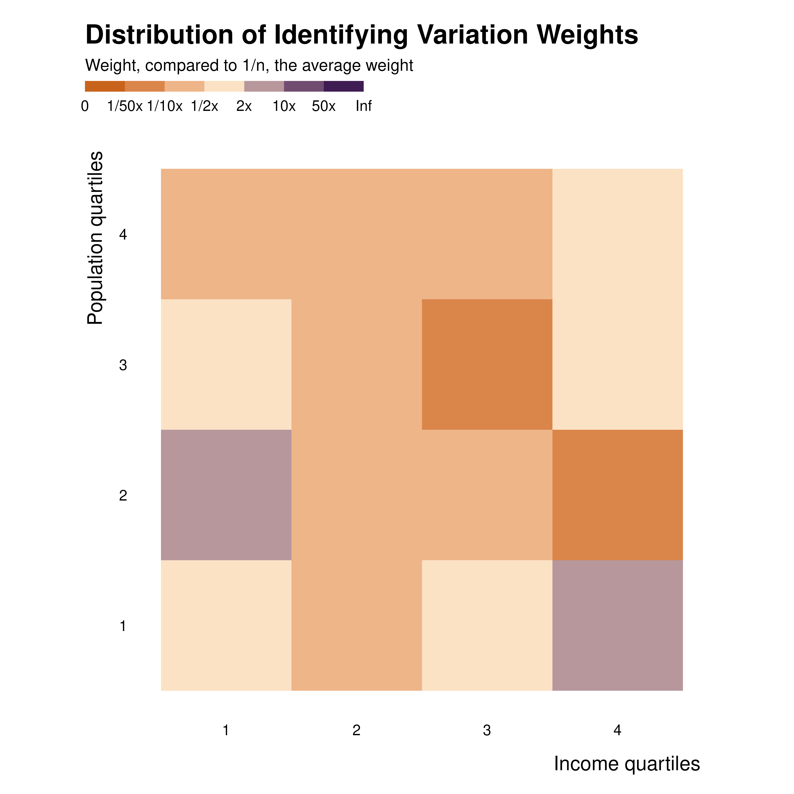
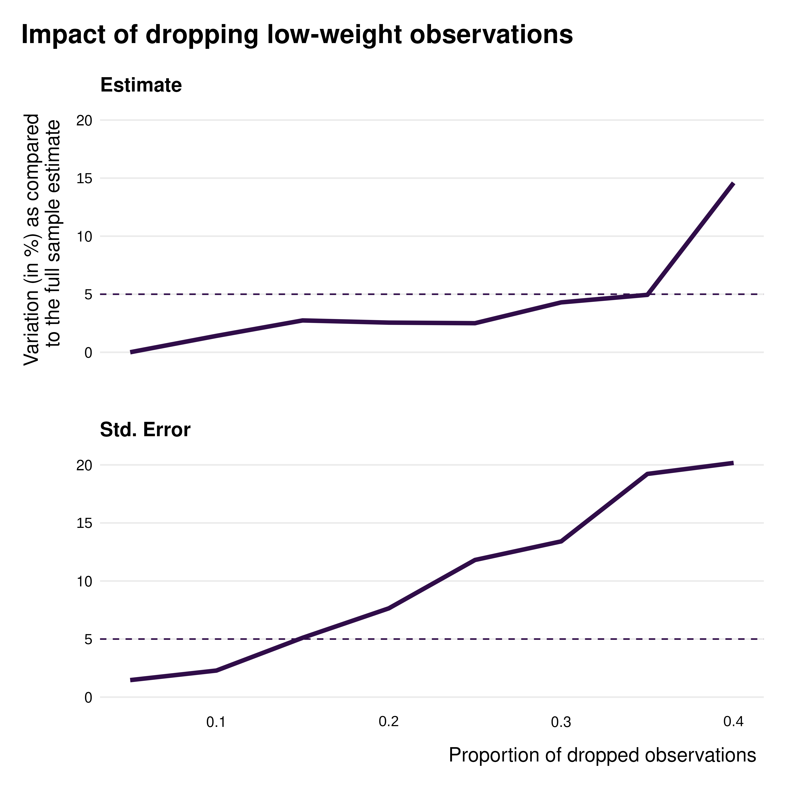
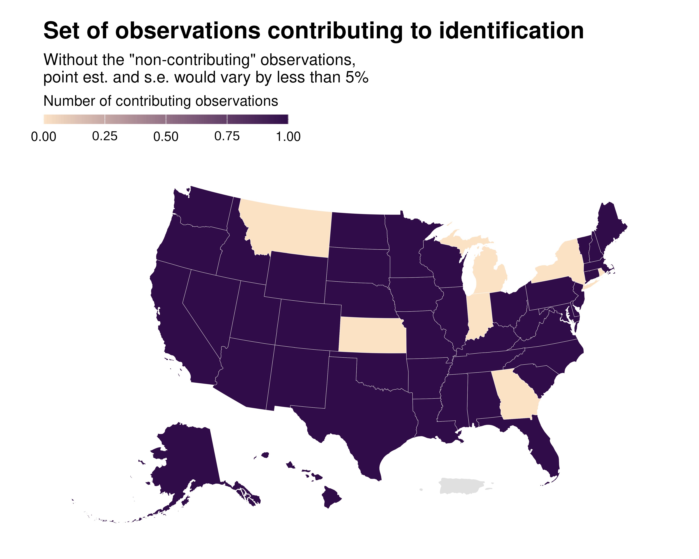

# ididvar

The present vignette quickly **presents a typical workflow for
analysis**, using a very basic example. It also provides an **overview
of most of [the
functions](https://vincentbagilet.github.io/ididvar/articles/reference/index.md)
available** in the package.

A more thorough example, with an actual analysis and interpretation of
the results, is [available on the research project’s
website](https://vincentbagilet.github.io/causal_exaggeration/ididvar.html).

## Overview of a typical workflow

The workflow to get a better understanding of observations of groups of
observations contributing to identification is relatively
straightforward:

1.  **Visualize the relationship** between x and y after partialling out
    (with the `idid_viz_bivar` function)
2.  Compute the **observation level weights** and add a `weight`
    variable to the data set (using `idid_weights`)
3.  **Visualize** the distribution of these weights (the cumulative with
    `idid_viz_cumul`, at the observation and group level with
    `idid_viz_weights` or `idid_viz_weights_map`. To **identify groups**
    and variables for which there is a large heterogeneity in weights
    across groups, use `idid_grouping_var`). At this stage, one might
    already get a sense of the effective sample
4.  Compute the set of **identify contributing observations**, *ie*
    observations that we can drop without too much altering the estimate
    (observations whose weight is larger than a threshold computed with
    `idid_contrib_threshold`).
5.  **Visualize contributing observations**, both individual and groups
    (using `idid_viz_contrib` and `idid_viz_contrib_map`)
6.  Compute and visualize the **effective sample size** (with
    `idid_viz_drop_change` and `idid_contrib_stats`)

## Visualize relationship

Let’s assume we have already ran the regression of interest.

``` r
library(ididvar)
library(dplyr)
library(ggplot2)
library(tigris)
library(knitr)

data_ex <- state.x77 |>
  as_tibble() |>
  dplyr::mutate(
    state = rownames(state.x77),
    pop_quartiles = cut_number(Population, 4, labels = FALSE),
    murder_quartiles = cut_number(Murder, 4, labels = FALSE),
    income_quartiles = cut_number(Income, 4, labels = FALSE)
  ) 

reg_ex <-lm(data = data_ex,
            formula = Illiteracy ~  Income + Population + `Life Exp` + Frost)
```

We first visualize the relationship between x and y (here `Illiteracy`
and `Income`) after partialling out to understand what we are estimating
and to visualize what is driving our

``` r
idid_viz_bivar(reg_ex, "Income")
```



## Compute weights

We can **add the weights to the data**. This step is optional as most
functions will recompute the weights.

``` r
data_ex_weights <- data_ex |> 
  mutate(idid_weight = idid_weights(reg_ex, "Income"))
```

## Visualize the weights

We can plot the distribution of weights using the `idid_viz_cumul`
function.

``` r
idid_viz_cumul(reg_ex, "Income")
```



That allows us to analyse the extend to which the weights are evenly
distributed. A very unequal distribution should hint that some
observations contribute much more to identification and that some
observations may not contribute much.

We may then want to explore the distribution of weights, using the
`idid_viz_weights` function. This function makes a graph to visualize
the identifying variation weights (a heatmap or a bar chart, depending
on the number of dimensions specified). Depending on the shape of the
data, there might be some obvious way to analyse it: if, as in the
present example, the data is a cross-section, one may want to plot the
data by individuals, only providing `var_x` or `var_y` to the
`idid_viz_weights`.[¹](#fn1)

``` r
idid_viz_weights(reg_ex, "Income", var_y = state, order = "y")
```



If the data is an individual-time panel, one may want to plot each
observation using a heatmap. That can be done with, by providing these
two dimensions as the `var_x` and `var_y` arguments of
`idid_viz_weights`.

When the data has a geographical dimension, one may want to plot a map
of the weights. The function `idid_viz_weights_map` allows to do easily
do that by only providing a shape file in a `sf` format along with the
join variable name.

``` r
states_sf <- tigris::states(
    cb = TRUE, resolution = "20m", year = 2024, progress_bar = FALSE) |>
  tigris::shift_geometry() |> 
  rename(state = NAME)

idid_viz_weights_map(reg_ex, "Income", states_sf, "state")
```



## Groups

In addition–or instead–, it is often interesting to analyse whether some
groups have larger weights, *ie* contribute more, than others. One may
have *a priori* ideas regarding which variables to group by. In cases
when this might be less clear, one can use `idid_grouping_var` to
identify variables for which groups created by each variable considered
(in the `grouping_vars` argument of the function) have the most between
group variance in weights, suggesting a large heterogeneity in weights
across groups.

``` r
idid_grouping_var(
  reg_ex, "Income", 
  grouping_vars = c("income_quartiles", "pop_quartiles", "murder_quartiles")
) |> 
knitr::kable()
```

| grouping_var     | between_var |
|:-----------------|------------:|
| income_quartiles |   0.0536434 |
| pop_quartiles    |   0.0352604 |
| murder_quartiles |   0.0213752 |

Here, the larges between group variance is across `income_quartiles`,
suggesting that some income group may have larger weights than others.
Now that dimensions along which it makes sense to group the weights by
have been identify, one can plot the weights distribution across groups.

``` r
idid_viz_weights(reg_ex, "Income", income_quartiles) +
  labs(
    x = "Income quartiles", 
    title = "Distribution of Identifying Variation Weights By Income",
    subtitle = "High income states contribute more to the estimation"
  )
```



Such an analysis can also be implemented for two variables at the same
time, thus building heatmaps. This is done with the same method as the
one used for individual observations discussed above.

``` r
idid_viz_weights(reg_ex, "Income", income_quartiles, pop_quartiles) +
  coord_fixed() +
  labs(x = "Income quartiles", y = "Population quartiles")
```



Through all these explorations, one can get a sense of the distribution
of weights, through space or groups.

## Contribution

We now may wonder which observations contribute to the estimation and
which do not. To do so, the present package identifies observations with
low weight that can be dropped without affecting the point estimate
*and* standard errors by more than a given proportion.

This can also be illustrated via the `idid_viz_drop_change` function. It
plots a faceted line graph describing the percentage variation of the
point estimate and s.e. of interest as a function of the proportion of
observations dropped.

``` r
idid_viz_drop_change(
  reg_ex, 
  "Income", 
  threshold_change = 0.05, #position of the dotted line
  search_end = 0.4
)
```



This function loops over the `idid_drop_change` function which, for a
given proportion of observations dropped, computes a variation of the
point estimate and standard errors of the coefficient of interest when
dropping low weight observations.

Using the `idid_contrib_threshold` one can identify a weight threshold
below which removing observations does not change the point estimate or
the standard error of the estimate of interest by more than a given
proportion, *se* 5%:

``` r
idid_contrib_threshold(reg_ex, "Income", threshold_change = 0.05)
#> [1] 0.0004276697
```

All observations with a weight below 4.28^{-4} can be dropped without
changing the estimate of interest by more than 5%.

We define the **effective sample** as the set of observations whose
weights are above the aforementioned threshold.

We first use the `idid_contrib_stats` function to compute the size of
this effective sample (as well as of the initial and nominal one):

``` r
idid_contrib_stats(reg_ex, "Income") |> 
  knitr::kable()
```

| n_initial | n_nominal | n_effective | prop_effective |
|----------:|----------:|------------:|---------------:|
|        50 |        50 |          43 |           0.86 |

We then characterize this effective sample using the `idid_viz_contrib`
and `idid_viz_contrib_map` functions. They work in a similar ways as
`idid_viz_weights` and `idid_viz_weights_map`.

``` r
idid_viz_contrib(reg_ex, "Income", income_quartiles)
```


``` r
idid_viz_contrib_map(reg_ex, "Income", states_sf, "state")
```



[Online
appendices](https://vincentbagilet.github.io/causal_exaggeration/ididvar.html)
of the [associated
paper](https://vincentbagilet.github.io/causal_exaggeration/causal_exaggeration_paper.pdf)
complements the present vignette by providing an example of a practical
implementation of an analysis using the `ididvar` package.

The [“Own visualizations”
vignette](https://vincentbagilet.github.io/ididvar/articles/own-viz.md)
provides a discussion and code to customize these graphs.

------------------------------------------------------------------------

1.  The `order` parameter allows to sort individuals by weight, along
    the specified axis (here y)
